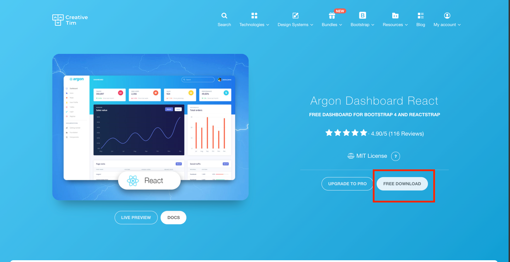

## Adding Design, Styles and Themes

There is a list of [16 best React Component Libraries](https://technostacks.com/blog/react-component-libraries). 

These may be very helpful, however in our case, we are trying to find not only component libraries but also templates that leverage these component libraries so that we can easily plug in and go.

### 1. Choose a Design Library and Template

The following are suggested. Since Creative Tim has done the honor of creating these as already built react-apps, I highly recomend using his:

| Component Library | Template List   |
| ----------------- | ----------- |
| [React Strap Component Library](https://www.creative-tim.com/templates/react)            | [Templates](https://www.creative-tim.com/templates/react)       |
| [Material UI](https://mui.com/getting-started/usage/)         | [Templates](https://material-ui.com/store/)        |

### 2. Download the source code

### 3. Copy Dependencies

Navigate to the package.json file of the source code, and copy and paste it into your package.json file to get te necessary dependencies. Run the following:

        npm install

### 4. Leverage Code

Use the code already written for pages and components. To get more components, import them based on the component documentation. An example is:

        import { Button } from '@material/ui';