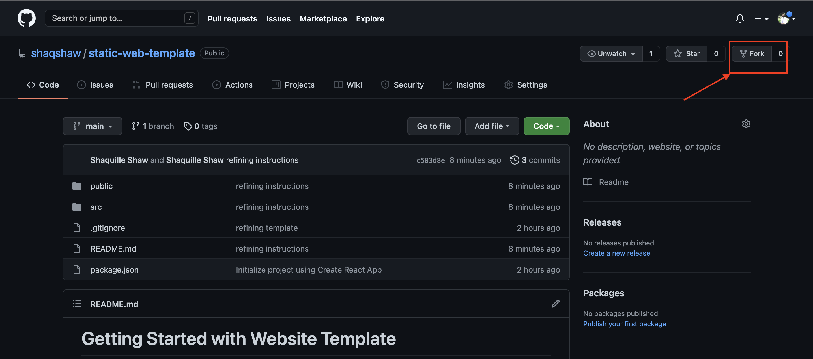
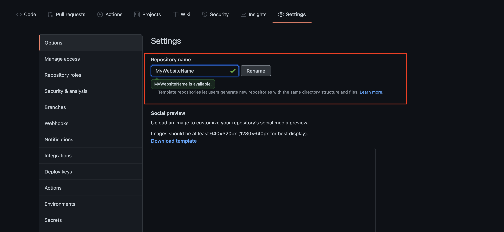

## Getting Started

### 1. Fork this repository

### 2. Rename your project

### 3. Clone your repository

        git clone *your repo link here*

### 3. Install Dependencies

In your root directory

        npm install

### 4. Start App Locally

In your root directory

        npm start 

Navigate to http://localhost:3000 to see app running

### 5. Update HTML Meta Tags

In the /public/index.html file fill out the following details for the Website

        <meta name="description" content="">
        <meta name="keywords" content="">
        <title>Website Name</title> 
